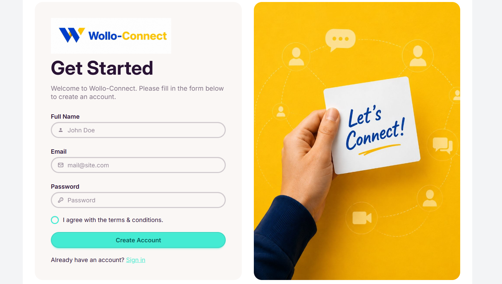
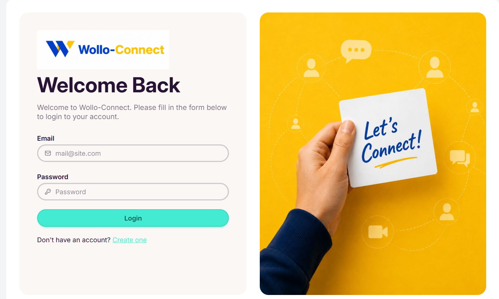
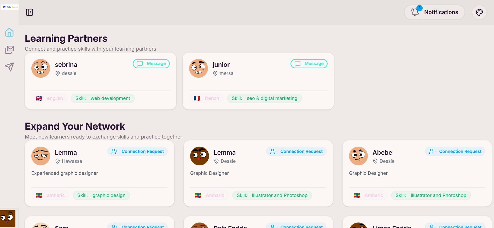
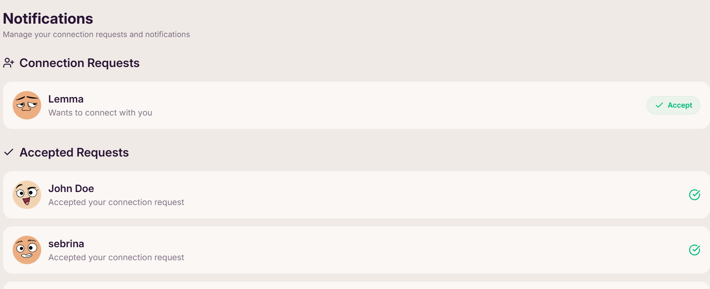
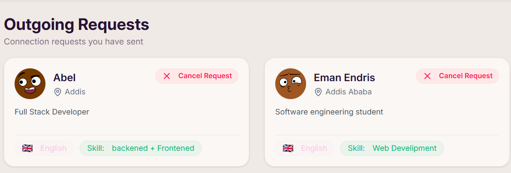
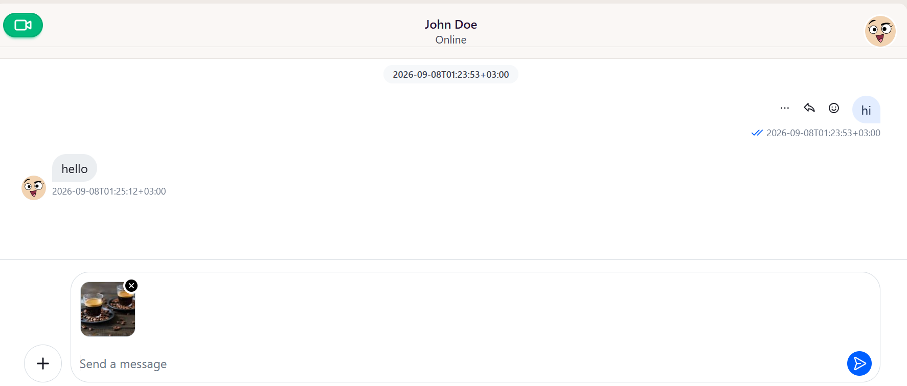

# Wollo Connect

<p align="center">
  A full-stack social networking platform for discovering, connecting, and communicating with people based on shared skills, languages, and locations.
</p>

<p align="center">
  <a href="https://wollo-connect-frontend.onrender.com">🚀 Live Demo</a>
  ·
  <a href="https://github.com/EmanEndris-create/Wollo-connect">📦 GitHub Repository</a>
</p>

---

## 🌐 Live Demo

🚀 **Try Wollo Connect:**

**[Open Wollo Connect →](https://wollo-connect-frontend.onrender.com)**

---

## 📖 About The Project

**Wollo Connect** is a full-stack social networking and connection platform designed to help users discover and connect with people who share similar interests, skills, languages, and locations.

The application provides a complete user experience starting from registration and onboarding, through discovering recommended users and managing connection requests, all the way to communicating with connections through real-time video calls.

The project was built to practice and demonstrate real-world full-stack development concepts, including authentication, REST APIs, relational databases, recommendation logic, server-state management, protected routes, and real-time communication.

---

## ✨ Features

### 🔐 Authentication

* User registration
* User login
* Secure password hashing with bcrypt
* JWT-based authentication
* Access and refresh token system
* HTTP-only authentication cookies
* Protected backend routes
* Authentication persistence
* Automatic authentication checking
* Logout functionality
* Refresh token support

---

### 👤 User Onboarding

After creating an account, users complete their profile through an onboarding process.

Users can provide information such as:

* Full name
* Email
* Skills
* Language
* Location
* Profile information
* Profile image/avatar

The application tracks the user's onboarding status and redirects users appropriately depending on whether their profile setup is complete.

---

### 🤝 Smart User Recommendations

Wollo Connect recommends users based on similarities between their profiles.

The recommendation system currently considers:

* Shared skills
* Shared language
* Same location

Users receive a match score based on these similarities.

#### Match Scoring

```text
Same skill       → +5 points
Same language    → +2 points
Same location    → +1 point
```

This allows users with more similarities to receive a higher recommendation score.

The system also checks existing connection requests so that users can see whether a request has already been sent.

---

### 📩 Connection Requests

Users can:

* Send connection requests
* View incoming requests
* Accept connection requests
* Cancel outgoing requests
* See request status
* Prevent duplicate pending requests

Once a request is accepted, the two users become connections.

---

### 📤 Outgoing Requests

Outgoing connection requests are separated from the main recommendation page.

Users can:

* View pending requests they have sent
* Cancel outgoing requests
* See the current status of requests

When a request is cancelled, the user can appear again in the recommendation list.

---

### 🔔 Notifications

Wollo Connect provides notifications for connection-related events.

Users can be notified when:

* Someone sends them a connection request
* A connection request is accepted
* Other supported user events occur

Notification state is managed so users can distinguish between new and previously viewed notifications.

---

### 👥 Friends & Connections

When a connection request is accepted, the users are added to each other's connections.

Users can view their existing connections through the friends/connections section.

---

### 🎥 Real-Time Video Calling

Wollo Connect integrates **Stream** for real-time video communication.

Users can:

* Start video calls
* Join video calls
* Enable or disable their microphone
* Enable or disable their camera
* Communicate in real time

The backend handles Stream authentication and user configuration while the frontend provides the calling interface.

---

### 🎨 Theme Customization

The application uses **DaisyUI** themes together with Tailwind CSS.

Users can change the application's theme through the theme selector.

The selected theme is dynamically applied using the HTML `data-theme` attribute.

---

### 📱 Responsive UI

The interface is built with:

* Tailwind CSS
* DaisyUI
* Lucide React

The application includes a responsive navigation/sidebar layout designed to work across different screen sizes.

---

# 🛠️ Tech Stack

## Frontend

| Technology           | Purpose                       |
| -------------------- | ----------------------------- |
| React                | Frontend UI                   |
| Vite                 | Development and build tool    |
| React Router         | Client-side routing           |
| Tailwind CSS         | Styling                       |
| DaisyUI              | UI components and themes      |
| Lucide React         | Icons                         |
| Axios                | HTTP requests                 |
| TanStack React Query | Server-state management       |
| Stream               | Real-time video communication |

## Backend

| Technology     | Purpose                   |
| -------------- | ------------------------- |
| Node.js        | JavaScript runtime        |
| Express.js     | REST API                  |
| MySQL          | Relational database       |
| mysql2         | MySQL driver              |
| bcrypt         | Password hashing          |
| JSON Web Token | Authentication            |
| cookie-parser  | Cookie handling           |
| CORS           | Cross-origin requests     |
| dotenv         | Environment configuration |
| Nodemailer     | Email functionality       |
| node-cron      | Scheduled tasks           |
| Stream         | Real-time communication   |

---

# 🏗️ Architecture

Wollo Connect uses a separate frontend and backend architecture.

```text
                    WOLLO CONNECT
                         │
             ┌───────────┴───────────┐
             │                       │
        FRONTEND                  BACKEND
             │                       │
          React                  Node.js
             │                       │
           Vite                  Express
             │                       │
      React Router             Controllers
             │                       │
      React Query                 Models
             │                       │
          Axios                  Middleware
             │                       │
             └───────────┬───────────┘
                         │
                       MySQL
                         │
                  Database Storage
```

---

# 📁 Project Structure

A simplified version of the project structure:

```text
Wollo-connect/
│
├── frontend/
│   ├── src/
│   │   ├── components/
│   │   ├── pages/
│   │   ├── hooks/
│   │   ├── lib/
│   │   ├── constants/
│   │   └── App.jsx
│   │
│   └── package.json
│
├── backend/
│   ├── controllers/
│   ├── models/
│   ├── routes/
│   ├── middleware/
│   ├── utils/
│   ├── config/
│   ├── app.js
│   └── package.json
│
├── .gitignore
└── README.md
```

---

# 🔄 Application Flow

A typical user journey through Wollo Connect looks like this:

```text
Register
   │
   ↓
Login
   │
   ↓
Authentication Check
   │
   ↓
Complete Onboarding
   │
   ↓
Home
   │
   ↓
Discover Recommended Users
   │
   ↓
Send Connection Request
   │
   ↓
Outgoing Requests
   │
   ↓
Request Accepted
   │
   ↓
Friends / Connections
   │
   ↓
Video Call
```

---

# 🔐 Authentication Flow

Wollo Connect uses JWT authentication with short-lived access tokens and longer-lived refresh tokens.

```text
                  User
                   │
             ┌─────┴─────┐
             │           │
          Sign Up     Sign In
             │           │
             └─────┬─────┘
                   ↓
            Backend Server
                   │
            Verify Credentials
                   │
                   ↓
             Generate JWTs
                   │
          ┌────────┴────────┐
          ↓                 ↓
     Access Token      Refresh Token
      Short-lived        Long-lived
          │                 │
          └────────┬────────┘
                   ↓
              Authenticated
                 User
```

Protected backend routes use authentication middleware to verify the access token and identify the current user.

Simplified flow:

```text
Request
   ↓
Authentication Middleware
   ↓
Verify JWT
   ↓
Extract User ID
   ↓
req.userId
   ↓
Controller
   ↓
Database
   ↓
Response
```

---

# 🔄 Frontend API Architecture

The frontend uses reusable custom hooks for API communication.

```text
React Component
       │
       ↓
useApiQuery / useMutateQuery
       │
       ↓
Axios Instance
       │
       ↓
Express REST API
       │
       ↓
Controller
       │
       ↓
MySQL
```

### Queries

`useApiQuery` is used for retrieving server data.

Examples include:

```text
GET /user/me
GET /user/friends
GET /user/recommended
GET /user/friend-requests
GET /user/friend-requests/outgoing
```

### Mutations

`useMutateQuery` is used for actions that modify server data.

Examples include:

```text
POST /auth/signup
POST /auth/signin
POST /user/onboarding
POST /user/friend-request/:id
DELETE /user/friend-request/:id
POST /user/friend-request/accept/:id
```

React Query invalidation is used to keep the interface synchronized with backend changes.

For example:

```text
Send Connection Request
          ↓
Backend Database Updated
          ↓
Invalidate Recommendation Query
          ↓
React Query Refetches
          ↓
Updated UI
```

---

# 🧠 Recommendation System

The recommendation system compares the current user's profile with other users.

A simplified representation of the scoring system is:

```sql
CASE
    WHEN u.skill = currentUser.skill THEN 5
    ELSE 0
END
+
CASE
    WHEN u.language = currentUser.language THEN 2
    ELSE 0
END
+
CASE
    WHEN u.location = currentUser.location THEN 1
    ELSE 0
END
```

The resulting `matchScore` can be used to rank users according to profile similarity.

The recommendation query also considers existing friend requests, allowing the application to determine whether a recommended user already has an outgoing request.

---

# 📡 API Endpoints

The backend API is organized into authentication and user routes.

## Authentication

```text
/api/auth
```

| Method | Endpoint            | Description            |
| ------ | ------------------- | ---------------------- |
| POST   | `/api/auth/signup`  | Create a new account   |
| POST   | `/api/auth/signin`  | Sign in                |
| POST   | `/api/auth/logout`  | Log out                |
| POST   | `/api/auth/refresh` | Refresh authentication |

---

## User

```text
/api/user
```

| Method | Endpoint                              | Description               |
| ------ | ------------------------------------- | ------------------------- |
| POST   | `/api/user/onboarding`                | Complete onboarding       |
| GET    | `/api/user/me`                        | Get authenticated user    |
| GET    | `/api/user/recommended`               | Get recommended users     |
| GET    | `/api/user/friends`                   | Get connections           |
| GET    | `/api/user/friend-requests`           | Get incoming requests     |
| GET    | `/api/user/friend-requests/outgoing`  | Get outgoing requests     |
| POST   | `/api/user/friend-request/:id`        | Send connection request   |
| DELETE | `/api/user/friend-request/:id`        | Cancel connection request |
| POST   | `/api/user/friend-request/accept/:id` | Accept connection request |

---

# 🗄️ Database

Wollo Connect uses **MySQL** as its relational database.

The database manages information related to:

* Users
* User profiles
* Skills
* Languages
* Locations
* Friendships
* Friend requests
* Request status
* Notifications
* Authentication-related data

During development, MySQL can be run locally using tools such as XAMPP.

For production, the database can be hosted using a cloud provider such as Railway.

---
# 🚀 Getting Started

## Prerequisites

Make sure you have installed:

* Node.js
* npm
* MySQL
* Git

---

## 1. Clone the Repository

```bash
git clone https://github.com/EmanEndris-create/Wollo-connect.git
```

```bash
cd Wollo-connect
```

---

## 2. Install Backend Dependencies

```bash
cd backend
npm install
```

---

## 3. Configure the Backend

Create:

```text
backend/.env
```

Add your database credentials, JWT secrets, Stream credentials, and other required environment variables.

---

## 4. Set Up MySQL

Create a MySQL database for Wollo Connect and configure the connection details in your `.env` file.

---

## 5. Start the Backend

For development:

```bash
npm run dev
```

The backend will normally run on:

```text
http://localhost:3000
```

---

## 6. Install Frontend Dependencies

Open another terminal:

```bash
cd frontend
npm install
```

---

## 7. Start the Frontend

```bash
npm run dev
```

Vite will normally provide:

```text
http://localhost:5173
```

---

# 🌐 Deployment

Wollo Connect is designed to use separate hosting for the frontend and backend.

### Frontend

The React/Vite application can be deployed using:

**Render**

### Backend

The Node.js/Express API can be deployed using:

**Render**

### Database

The production MySQL database can also be hosted using:

**Aiven**

---

# 🔒 Security

Security considerations implemented in the project include:

* Password hashing with bcrypt
* JWT authentication
* HTTP-only cookies
* Short-lived access tokens
* Long-lived refresh tokens
* Protected backend routes
* Environment variables for secrets
* CORS configuration
* Authentication middleware

Sensitive information should never be stored directly in source code.

---

# 🎨 UI & Component Architecture

The frontend uses reusable components to avoid duplicated UI logic.

For example, the `UserCard` component can be reused for different user lists:

```text
Recommended Users
       ↓
    UserCard

Outgoing Requests
       ↓
    UserCard

Other User Lists
       ↓
    UserCard
```

Other reusable frontend elements include:

* Sidebar
* Theme selector
* User cards
* Navigation components
* Loading states
* Empty states
* Authentication forms

---

# 🧪 Development

During local development:

```text
Frontend
localhost:5173

Backend
localhost:3000

MySQL
localhost:3306
```
---
## 📸 Screenshots

### 📝 Signup


### 🔐 Login


### Home


### 🔔 Notifications


### 📤 Outgoing Requests


### 📞 Chat Page


---

# 🔮 Future Improvements

Possible future improvements include:

* 💬 Real-time messaging
* 🔔 More advanced real-time notifications
* 🔎 User search and filtering
* 👤 More advanced profile customization
* 📷 Profile image uploads
* 🟢 Online/offline presence
* 📞 Call history
* 🧠 More advanced recommendation algorithms
* 📱 Improved mobile experience
* 🧪 Automated testing
* 🚀 CI/CD pipeline
* 📊 Analytics and monitoring
* 🛡️ More advanced security measures

---

# 🎯 What I Learned

Building Wollo Connect provided practical experience with:

* React application architecture
* Vite
* React Router
* Tailwind CSS
* DaisyUI
* Node.js
* Express.js
* REST API development
* MySQL
* SQL queries and relationships
* Authentication and authorization
* JWT access and refresh tokens
* Password hashing
* HTTP cookies
* React Query
* Axios
* Protected routes
* Custom React hooks
* Recommendation algorithms
* Connection/friend request systems
* Notifications
* Real-time video communication
* Responsive UI design
* Full-stack debugging
* Cloud deployment

---

# 🤝 Contributing

Contributions, suggestions, and improvements are welcome.


# 📄 License

This project is currently intended for educational and portfolio purposes.

If the project is later released as open source, an appropriate license can be added here.

---

# 👨‍💻 Author

## Eman Endris

Software Engineering Student & Full-Stack Developer

GitHub:
https://github.com/EmanEndris-create

---

<p align="center">
  ⭐ If you find this project interesting, consider giving it a star!
</p>

<p align="center">
  Built with 🩶 using React, Node.js, Express, and MySQL.
</p>
